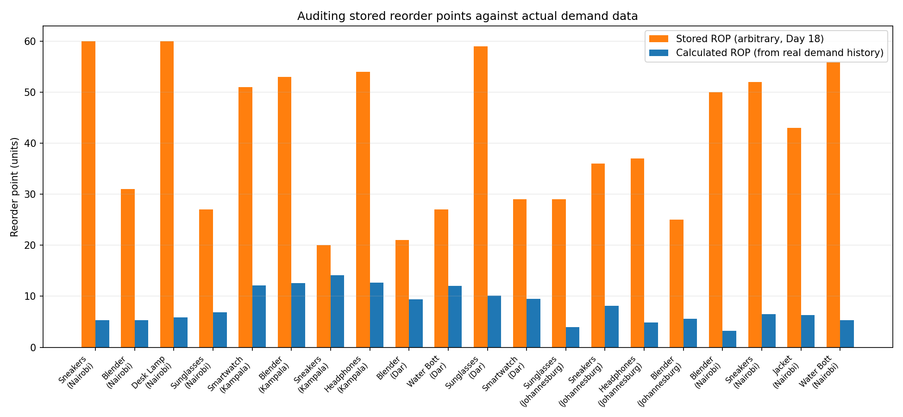

# Are Boxleo's Reorder Points Actually Right? A Data Audit

A case study in connecting order data to inventory math — built on a mock SQLite database modeling a pan-African e-commerce fulfillment operation, inspired by Boxleo Courier's real multi-country structure.

## The question

Every SKU in a warehouse system has a reorder point — the stock level that triggers a new order. But where do those numbers actually come from, and do they hold up against real demand? This project started as a database of orders, inventory, and shipments (see schema below). It became a question worth investigating: **if I calculate what each product's reorder point *should* be, based on its actual sales history, does it match what the system has stored?**

## The setup

The database models four countries (Kenya, Uganda, Tanzania, South Africa), five merchants, 120 orders, and — after extending the schema with an `order_items` table — 213 individual product-level line items, giving each of the 20 SKUs a real, traceable demand history across a 44-day window.

**Schema:**
- `merchants` — the businesses being served, their country, region manager
- `inventory` — 20 SKUs, current quantity, warehouse location, stored reorder point
- `orders` — 120 orders across 4 statuses (delivered, delayed, pending, cancelled)
- `shipments` — delivery tracking, promised vs. actual dates
- `order_items` — *(added for this audit)* links each order to specific SKUs and quantities

## The investigation

For each SKU, I pulled its full daily demand history from `order_items`, calculated the actual average daily demand and how much it varies day to day, and fed both into the standard inventory formulas:

- **EOQ** (Economic Order Quantity) — the order size that minimizes ordering + holding cost
- **Safety stock** — a buffer sized to a 95% service level, using the actual demand variability observed
- **Reorder point** — average demand during lead time, plus that safety buffer

Lead times were set using the same hub-and-spoke logic found in the original network analysis: hub locations (Nairobi, Johannesburg) get a 3-day lead time; spoke locations (Kampala, Dar es Salaam) get 6 days.

*(Note: the mock schema has no real cost data, so order cost and holding cost inputs are clearly labeled illustrative assumptions — $15/order and $2.50/unit/year — not sourced figures.)*

## The finding

**Every single SKU flagged as a mismatch.**

The stored reorder points (orange) sit far above what the calculated, demand-based reorder points (blue) actually call for — often by a factor of 4–10x.

This isn't a bug in the analysis. It's the finding itself: the original reorder points were assigned arbitrarily when the mock database was first built, before any real order data existed to base them on. Once real demand history was added, it became possible to check those numbers for the first time — and every one of them turned out to be disconnected from reality.

## Why this matters

This is a small, mock-data version of a real, common operational problem: **systems accumulate configuration values that were reasonable guesses at setup time, and nobody re-checks them once real data starts flowing in.** A reorder point set too high means capital tied up in unnecessary safety stock; set too low, it means stockouts. Catching this kind of drift is a standing analyst task, not a one-time fix — which is why this audit is built as a reusable script, not a one-off calculation.

## Files

| File | Purpose |
|---|---|
| `boxleo_mock_wms.db` | The full database, including the extended `order_items` table |
| `extend_db.py` | Adds `order_items` and populates realistic per-order line data |
| `integrate.py` | Pulls demand history, runs the EOQ/safety-stock/ROP calculations, flags mismatches |
| `integration_chart.py` | Generates the comparison chart above |
| `ops_queries.sql` | The original 10 operational SQL queries (stockouts, delivery performance, cancellations) |

## What I'd do next

Re-run this audit as a standing check whenever new order data accumulates, and use it to actually correct the stored reorder points — turning a one-time investigation into an operational habit.
